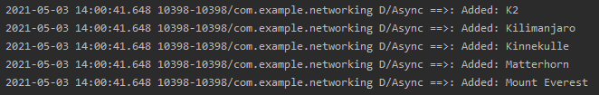
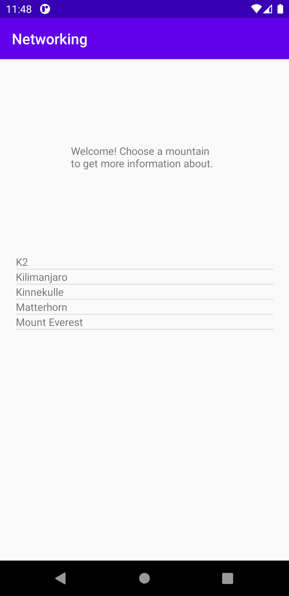
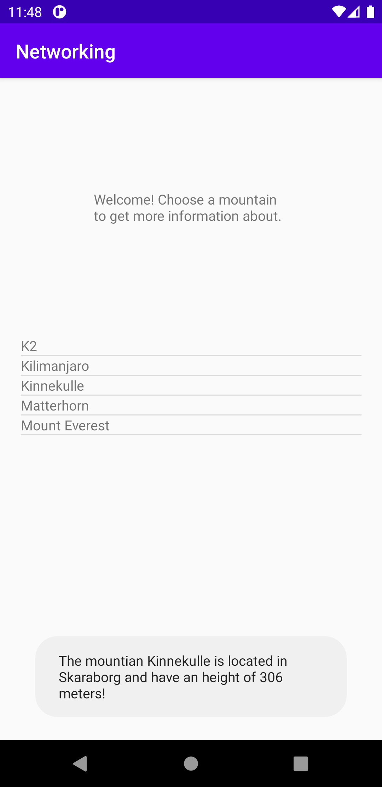

# Rapport

## Assignment 6: Networking

Den datan som vi vill visa i våran app kommer ifrån en json fil som har lästs in. För att lagra informationen
så vi kan använda den så skapar vi en ArrayList som vi kan se i koden nedan och döper den till listOfMountains.
Sedan skapar vi en ny gson som kan omvandla informationen så vi kan hantera den i våran app och lagrar
informationen i en array som vi kallar för mountains. Sedan kör vi igenom våran array i en for-loop
för att sortera upp informationen till vår ArrayList. Som vi kan se i Figur 1 så adderas fem olika berg
till våran ArrayList ifrån arrayen som vi skapade med hjälp av gson.

```
private ArrayList<Mountain> listOfMountains = new ArrayList<>();

Gson gson = new Gson();
Mountain[] mountains;
mountains = gson.fromJson(json,Mountain[].class);

for (int i = 0; i < mountains.length; i++) {
    listOfMountains.add(mountains[i]);
    Log.d("Async ==>", "Added: " + mountains[i]);
}
```


*Figur 1. Berg adderas till arraylistan*

Efter att våra berg är adderade behöver vi en ListView där vi kan visa upp dem i appen. För att visa
bergen i en ListView behöver vi skapa en ArrayAdapter som vi kopplar till våran listview. Det medför att
vi har en adapter som använder oss utav våran mountain class och kan ändra layouten för en textview
som i sin tur är kopplad till listviewn som vi använder oss av. På så vis kan vi välja vilken information
av bergen vi vill visa i våran lista samt vad som ska hända när vi klickar på ett objekt.

```
private ListView listView;
private ArrayAdapter<Mountain> adapter;
adapter = new ArrayAdapter<Mountain>(MainActivity.this, R.layout.list_item_textview,listOfMountains);
listView.setAdapter(adapter);
```


*Figur 2. Listview med alla berg*

För att presentera mer information om bergen så börjar vi med att skapa en item click listener som
fungerar för varje item som klickas på så att inte samma information visas oavsett på vilken rad man
klickar på. Med hjälp av våran lista av berg så kan vi få ut vilken position berget har för att få
rätt information att visas. När rätt position är lokaliserad så kan vi komma åt all information och kan
använda oss utav det i en toast. I koden nedan väljer vi att skriva ut text tillsammans med bergsnamnet,
var det finns och hur högt det är. Detta visas i ett meddelande en kort stund på skärmen när användaren
tryckt på ett berg i listan som vi kan se i Figur 3.

```
listView.setOnItemClickListener(new AdapterView.OnItemClickListener() {
@Override
public void onItemClick(AdapterView<?> parent, View view, int position, long id) {
    Mountain toastMsg = listOfMountains.get(position);

    toastMsg.getName();
    toastMsg.getLocation();
    toastMsg.getHeight();

    String send = "The mountian " + toastMsg.getName() + " is located in " + toastMsg.getLocation() + " and have an height of " + toastMsg.getHeight() + " meters!";

    Toast.makeText(MainActivity.this, send, Toast.LENGTH_LONG).show();

    Log.d("OnClick ==>","Mountain: " + toastMsg.getName());
}
});
```


*Figur 3. Toast efter klick*